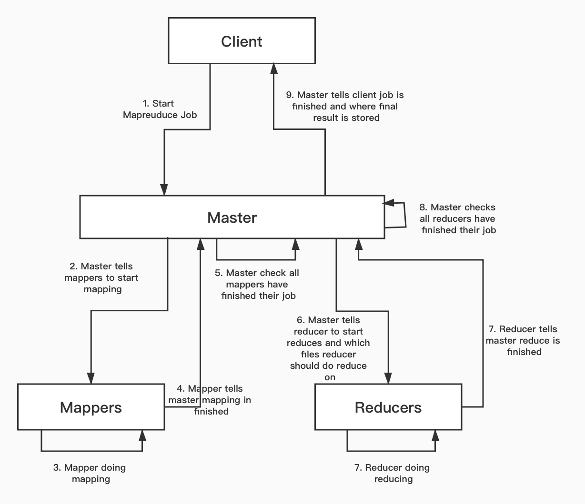
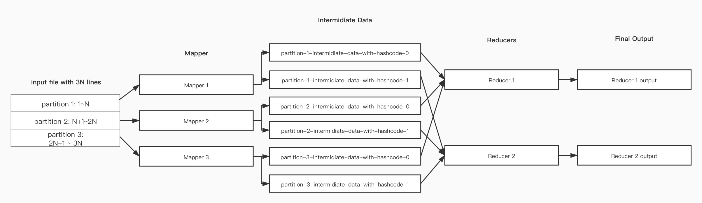
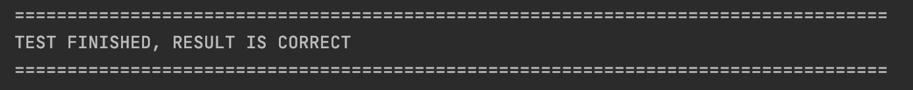
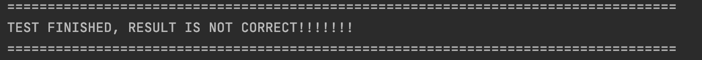
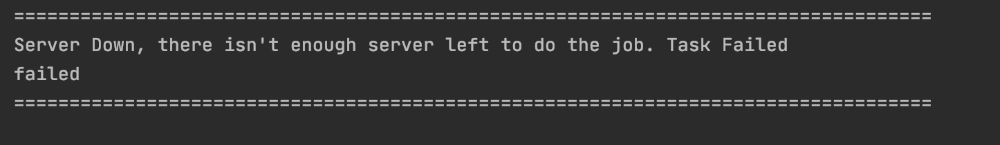

[TOC]

This readme is converted into a pdf version, you can download here [Download PDF](doc/designDoc.pdf)

### Env Requirement

- JDK:  1.8.0
- Language Level: 8
- Intellij idea.

### Project Structure

- **Config.java** Configuration file, define parameters. i.e port number for server, number of worker server etc.
- **Node.java** Each node(server) in the framework. Masters and Workers runs on the Node.
- **WorkerServer.java** Wokers in mapreduce
- **Master.java** Master in mapreducee.
- **Client.java**  Client(user program).
- **Mapper.java** Mapping scripts for each tasks.
- **Reudcer.java** Reducing scripts for each tasks.
- **MapReduce.java** Use multi-process to start(deploy) all master and worker servers.
- **mrUtils.java** Utils for the project.
- **TestResult.java** Testing framework for auto run mapreduce, and test the result.
- **Cleaner.java** Kill all node processes(shut down all servers)


### Design Consideration

This project uses socket to send and receives message. How this system works, and the partition method will be discussed below.

#### Flow Graph



### API Document
Master: 
|  method  | format  | usage |
|  ----  | ----  |----- |
| get  | start/master/file=\<file dir\>/job=\<job name\> | receive message from client, start mapreduce.|
| get  | mapper-task-finish/id=\<mapper server id\>/file=\<mapper intermediate data dir\>| receives message from mapper when mapper finishes its job. |
| get  | reducer-tasl-finish/id=\<id\>/file=\<reduce result file dir\> | receives message from reducer when reducer finishes its job.|

Workers:
|  method  | format  | usage |
|  ----  | ----  |----- |
| get  | start/worker/mapper/file=\<file dir\>/startline=\<start line number\>/endline=\<end line number\>/partitionId=\<pid\>  | mapper receive message from master, start mapping phase.|
| get  | assignrole/\<role\>/\<jobname\> | receives message from master, set role to worker(mapper or reducer), and set job to worker.|
| get  | start/worker/reduce/mapperId=\<mapper server id\>/filePath=\<file path\> | reducer receives message from master, tell it where the intermediate file is stored.|
|get | heartbeat/\<stage\> | detect user failure, parameter stage is used to test fault tolerance, can be ignored |

#### SERVER SOCKET PORTS

The port number for each server and client are defined in Config.java.

By default, client runs on 8080, and Master server runs on 34000, and all worker server's port start from 34001 and increase by 1. Suppose we have 6 workers, 1-2 do mapping, 3-5 do reducing, 6 is idel for fault tolerance.

| Server | Port | Id |
| ---- | ---- |
|Client| 8080| - |
|Master| 34000| - |
|Map Server 1| 34001| 1 |
|Map Server 2| 34002| 2 |
|Reduce Server 1| 34003 | 3|
|Reduce Server 2| 34004 | 4|
|Reduce Server 3| 34005 | 5|
|Idel Server 1| 34006 | 6|

When runing the program, if the ports are already under use, you can change it in Config.java


#### Partiton Method
- Master's partition
Master uses line number to do the partition. 
For example, if we hava 3 mappers, the fill will be divide in to 3 parts with equal line numbers. And the first 1/3 part of the input file will be distributed to mapper 1, and the second part will be distributed to mapper 2, and the last part will be distributed to mapper 3.

- Mapper and Reducer's partition
Mapper uses key's hashcode to do the partition.
For example, if we have 2 reducers. The first reducer will be responsible for key with hashcode 0, and the second will be responsible for key with hashcode 1.
And when mapper generates the intermidiate data, each k-v pair with key's hashcode%num_reducers equals 0 with be written in file_hashcode_0, and key's hashcode equals 1 with be written in file_hashcode_1.
As a result, when reduce reads data, if only need to read files containing corrosponding hashcode.

For example, we have an inputfile with 3N lines, and 3 Mappers and 2 reducers. and the graph blow with show how mappers and reducers work and interact with each other.



#### Intermediate data and output files
##### Intermediate data
Each mapper with generate N (N equals number of reducers) intermediate datas, and they will be named using the following format: **partition-\<partitionId\>-hash-\<hashcode\>_\<jobname\>.txt**

##### Final output
Each reducer will generate only one output file. And they will be name using the following format: **\<jobname\>_final_result-reducerId-\<id\>-hashchode-\<hashcode\>.txt**

**When running, you can see these files are stored under root directory.**

#### Multi-thread variable safety

We use multiple thread to send, receive, parse socket message. And master need to maintain the status of each server, each partition, we need to consider thread safety. When uses **ConcurrentHashMap** and **ReentrantLock** to ensure thread safety.

For each operation that multiple-thread can do simultaneously, we have a procedure like this:

```java
//concurrenntHashMap
public static ConcurrentHashMap<Integer, Boolean> mapperPartitionStatus;
public static ConcurrentHashMap<Integer, Boolean> reducerFinishStatus;


mapperStatusLock.lock();
//operation on different variable
mapperStatusLock.unlock();
```

### How to Run

- Method 1
  - 1. Run Mapreduce's main, all servers will be deployed
    2. Run client's main
- Method 2
  - 1. Run master server using Node(masterServerPort, 1, 0)
    2. Run worker server using Node(workerServerPort, 2, workerId) for each worker
    3. Run client's


The number of workers are defined in Config.java.
You can modify the number of Mapper Nodes and Reducer Nodes in it. But please make sure number_mappers + num_reducers \<= num_workers.
```aidl
public static int num_wokers = 5;
public static int num_mappers = 2;
public static int num_reducer = 3;
```

**Note:**
Second method is preferred, since it is easier to run.
The log files will be stored in log/*.txt.
To track it, you can use the following command:
```$xslt
tail -f log/Master.txt
```

### How to Test
We have encapsulated all the steps in the TestResult.java. To run it, you simply need to change the index in main to specify the job you want to run and run TestResult.main(). And after the job finishes, we will automatically test the result and provide you whether it's correct or not.
```$xslt
int index = 0;
//index=0: wordcount
//index=1: ordercount
//index=2: maxValue
```
Sometimes the output file will not show immediately, but it does exists, you can use tail command to track it.

If you want to change the number of mapper worker and reducer worker, you can change it in Config.java. And please make sure num_workers \>= num_mappers + num_reducer;
```
public static int num_wokers = 5;
public static int num_mappers = 2;
public static int num_reducer = 3;
```

After you run the program, if the result is correct, you will get the following result:



If the result is not correct, you will get the following result:



If there isn't enought server to finish the job, you will get:




### Provided Tasks

We have provided three task for mapreduce.
- Task 1: wordcount. Count word in the txt file.
- Task 2: ordercount. Count which orders has purchased certain product.
- Task 3: maxvalue. Find the max purchased number for each product in all orders.


### Fault Tolerance

Fault tolerance is added to this program. 

We use heartbeat to detect each server's status. And since shutting down a process is hard, we use the heartbeat response message to mimic whether a server is good or not.  And at which stage it become unavailable. And we uses a variable in Config to determine which server and which stage we plan to shut down the server.

In this way, we don't need to shut down a process, we just need to start fault tolerance whenever the master server receives 500 as heartbeat response.

If you don't want any fault tolerance, please set both variable in config to -1.

```java
//format: heartbeat/stage
public String parseHeartbeatMessage(String message) {
	int stage = Integer.valueOf(message.split("/", 0)[1]);
	if(ws != null && ws.getWorkerId() == conf.failWorkerId && stage == conf.failStage) {
		System.out.println("System Down, accoding to config");
		return "500";
	} else {
		return "200";
	}
}
```

We have implemented four cases for fault tolerance.

- Case 1: Mapper shut down during mapping.
- Case 2: Reducer shut down during mapping.
- Case 3: Mapper shut down during reducing.
- Case 4: Reducer shut down during reducing.

We will talk about these cases below.

#### Case 1: Mapper shut down during mapping.

We assume fault occurs during mapping phase. To mimic the behavior, in the mapping script, we write this:

```java
if(serverId == conf.failWorkerId && conf.failStage == 1){
		System.out.println("Running mapping, system down, doing noting");
		sleep(10000000000L);
}
//followed by the mapping phase
```

In this way, the map server will return 500 as heartbeat response, and the UDF will sleep long enough, this mocks the behavior when mapper failed during mapping phase: no output. And if failStage==2, if will finished the job.

Let's say worker 1 failed, and master reassign worker 6 to be the new mapper. 

To check if master re-assigned another server to do the mapping, you can check both log/Master.txt, log/Worker_1.txt and log/Worker_6.txt.

You will be able to see that no information in Worker_1.txt showes that worker 1 did the job, and you can see worker 6 did the job.

Worker 1's log:

```
Running mapping, system down, doing noting
```

Worker 6's log:

```
SocketMessageHandler received message: assignrole/mapper/maxcount
SocketMessageHandler received message: start/worker/mapper/file=orders.txt/startline=5/endline=7/partitionId=1
assigned role: 0
...
...
...
...
write successful
```

Master's log:

```
ServerId: 2 is down
Start fixing
Fault occurs during mapping phase
Failed Server Type: Mapper
Reassigning mapper role to new Server
re-send start mapping message to new mapper
```

Client's compared result:

```
===================================================================================
TEST FINISHED, RESULT IS CORRECT
===================================================================================
```


#### Case 2: Reducer shut down during mapping

```java
if(reducerId == conf.failWorkerId && conf.failStage == 2){
		System.out.println("Running reducing, system down, doing noting");
		sleep(10000000000L);
}
```

This is similar to case 1, but not as complicated as case 1 to implement. In this case, we just need to check which reducer failed and assign a new reducer.

To test, you can set failedWorkerId to one of the reducer's id, and set failStage to 1,  and check their log's and the compared result.

Suppose worker 3 is a reducer, it fail during mapping phase. And worker 6 is assigned to be the new reducer. By checking the log, worker 3 will have a few heartbeat from stage 1. Because when master gets its failure, master stops sending heartbeat to it. And worker 6 will have log indicating it did the reduce job.

#### Case 3: Mapper shut down during reducing

Just role back to mapping phase and call case 1's method. 

To test, you can set failedWorkerId to one of the reducer's id, and set failStage to 2,  and check their log's and the compared result.

Suppose worker 1 is a mapper, it fail during reducing phase. And work. 6 is assigned to be the new mapper. By checking the log, worker 1 and worker 6 will both have to log indicating they did the mapping.

#### Case 4: Reducer Shut down during reducing

Assign a new reducer to do the old job. 

To test, you can set failedWorkerId to one of the reducer's id, and set failStage to 2,  and check their log's and the compared result.

Suppose worker 3 is a reducer, it fail during reducing phase. And worker 6 is assigned to be the new reducer. By checking the log, worker 3 will have heartbeat from both stage 1 and 2. And worker 6 will have log indicating it did the reduce job.

#### How to test

**When testing this part, please make sure  num_workers \>= num_mappers + num_reducer; and set the right failWorkerId and failStage in config.  And after satisfying these requirements, all you need to do is run TestResult.java, and check the output and log files.**

|  failWorkerId  | failStage  | Meaning |
|  ----  | ----  |----- |
|one of mapper's id | 1 | case 1 |
|one of reducer's id | 1 | case 2|
|one of mapper's id | 2| case 3|
|one of reducer's id | 2 | case 4|
